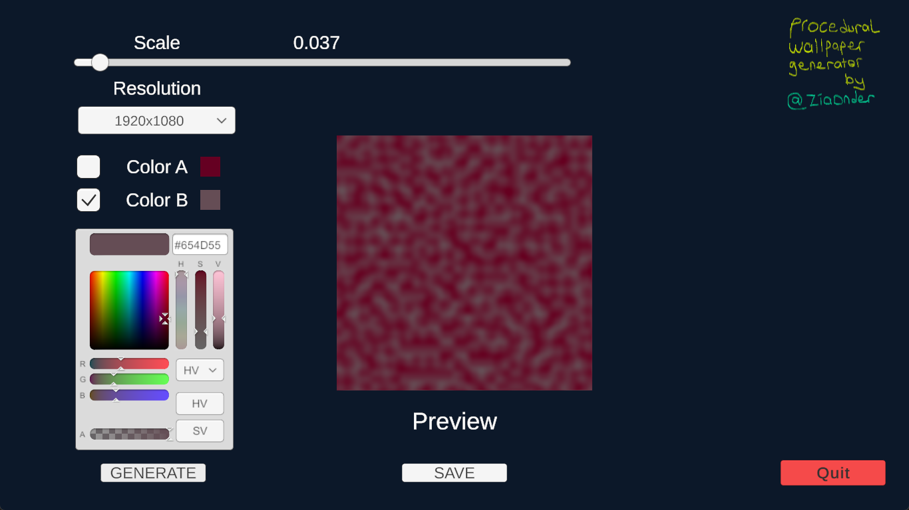
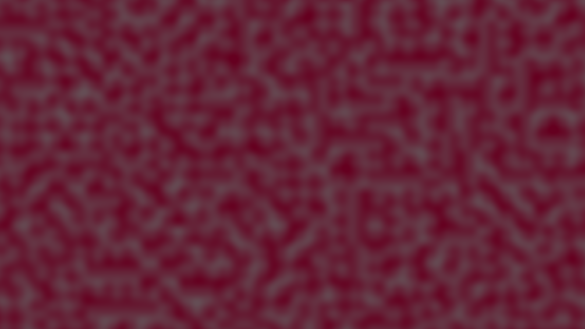

App uses Unity's built-in Perlin noise method. 
App can export to the given dimensions;
- Landscape
1920x1080  
1366x768
- Portrait
1080x1920  
368x1366

Scale for perlin noise starts from 0.001 and goes to 0.999.
Images are saved to Downloads folder for Windows user. Unavailable for other platforms.

## Screenshots

